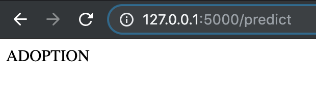

# First Flask App
Setting up a simple builtin API server with Flask

Full description of process and results can be found [here](https://medium.com/@sjacks/setting-up-a-simple-api-b3b00bc026b4)

## Purpose
My goal was to learn how to utilize Flask to set up an API that can accept features as inputs and return a prediction, based on a model I've trained.

## Data
Data and models are based on my work from my [Pet Adpotion Classification](https://github.com/MsJacksonIYN/PetAdoptionClassification) project.  The model used on the API has less features (and is less accurate) than my final model from that project. This was done in the sake of time and ease, since my goal here was learning how to utilize Flask.

## Results 
I created a python script that serves as an API server with the help of Flask.  Upon a GET request, the API returns HTML that can be rendered by a web browser as a submission form with drop-down options for features. Upon POST request, the API returns a prediction.

